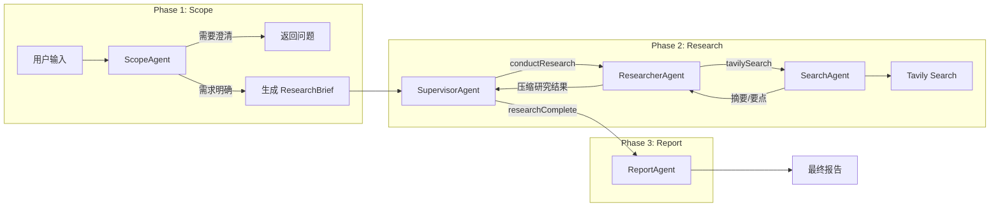
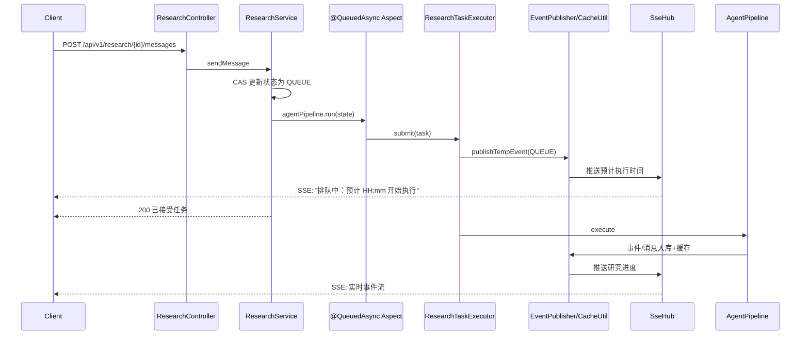
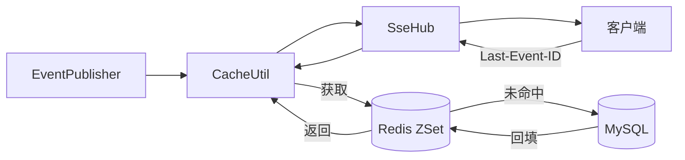
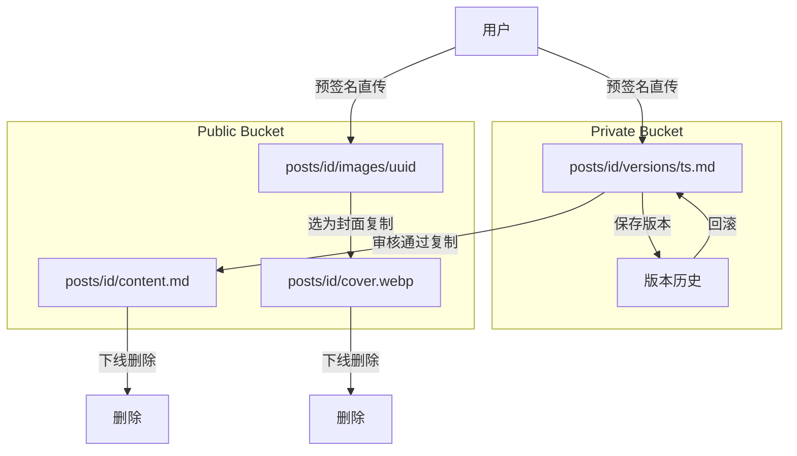
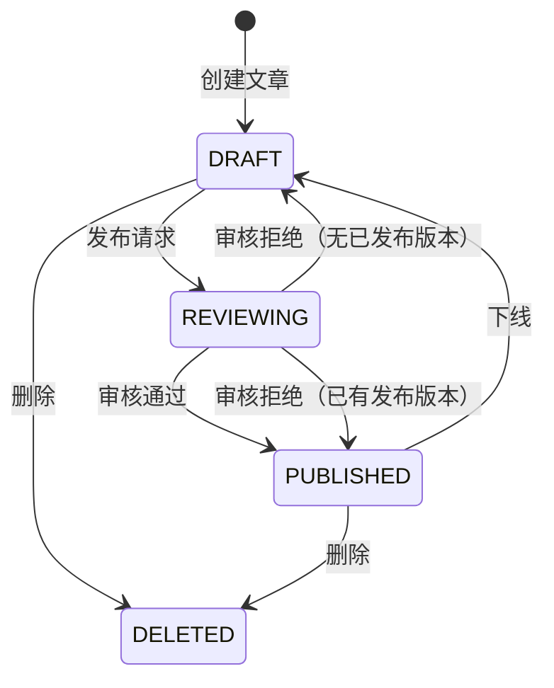

# KnowNote 知识写作平台

> 知识写作与分享平台，提供 AI 深度研究功能提供参考

## 功能特性

- **用户认证**：邮箱验证码/密码登录 + Google OAuth，JWT 双令牌机制
- **深度研究**：多智能体协作完成深度研究：参考[github.com/ChanlerDev/deep-research](https://github.com/ChanlerDev/deep-research)、在线[research.chanler.dev](http://research.chanler.dev)
- **文章管理**：编辑、版本历史、草稿/发布状态管理
- **内容审核**：RocketMQ 异步审核，LLM 判定合规性后自动流转状态

## 技术架构

**技术栈**：Spring Boot + LangChain4j + MyBatis-Plus + RocketMQ + Redis + MySQL + Cloudflare R2

### 系统架构

```mermaid
flowchart TB
    subgraph Client[客户端]
        FE[Web/Frontend]
    end

    subgraph Backend[后端服务]
        API[REST API]
        SSE[SSE Hub]
        Queue[ResearchTaskExecutor<br/>@QueuedAsync]
        Pipeline[AgentPipeline]
        MQ[RocketMQ]
        Review[PostReviewService]
        StorageSvc[StorageService]
        Auth[AuthService]
    end

    subgraph External[外部服务]
        LLM[LLM API]
        Tavily[Tavily Search API]
        Google[Google OAuth]
        Resend[Resend Email]
    end

    subgraph Storage[存储层]
        MySQL[(MySQL)]
        Redis[(Redis)]
        R2[(Cloudflare R2)]
    end

    FE -->|HTTP| API
    FE <-->|SSE| SSE
    FE -->|预签名直传| R2
    API --> Queue
    API --> MQ
    API --> StorageSvc
    API --> Auth
    Queue --> Pipeline
    Pipeline --> LLM
    Pipeline --> Tavily
    Pipeline --> SSE
    SSE --> Redis
    API --> MySQL
    API --> Redis
    StorageSvc --> R2
    Auth --> Google
    Auth --> Resend
    MQ --> Review
    Review -->|审核| LLM
    Review --> MySQL
    Review --> R2
```

### 智能体工作流



### 异步任务队列

自定义 `@QueuedAsync` 替代 `@Async`，实现有界排队与预计执行时间推送：



### SSE 断线重连

时间线事件落库（MySQL）并写入 Redis ZSet，断线后按 Last-Event-ID 续传（Redis 不命中则回源 DB）：



### 双 Bucket 存储

Private 存草稿与版本历史，发布时复制到 Public：



### 内容审核状态机

RocketMQ 异步审核，LLM 判定后自动流转：



## 项目结构

```
src/main/java/dev/chanler/knownote/
├── common/                 # 通用组件
│   ├── async/              # @QueuedAsync 异步任务
│   ├── sse/                # SSE 实时推送
│   └── util/               # 工具类
├── config/                 # 配置类
├── user/                   # 用户模块（认证、OAuth）
├── post/                   # 文章模块（编辑、版本、审核）
├── research/               # 研究模块
│   ├── agent/              # 智能体（Scope/Supervisor/Researcher/Report）
│   ├── tool/               # 工具注册中心
│   ├── workflow/           # AgentPipeline 流水线
│   └── state/              # DeepResearchState
└── storage/                # 存储模块（R2 对接）
```
